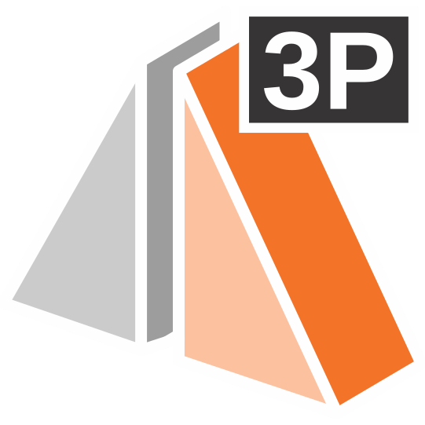
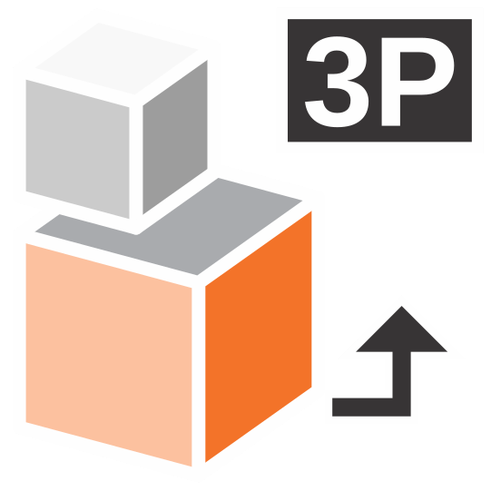
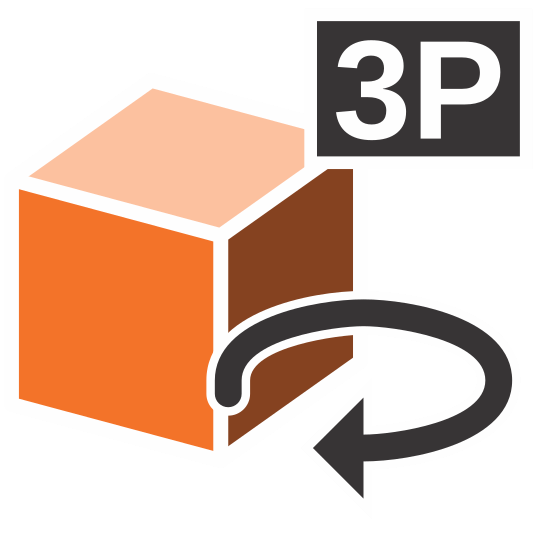
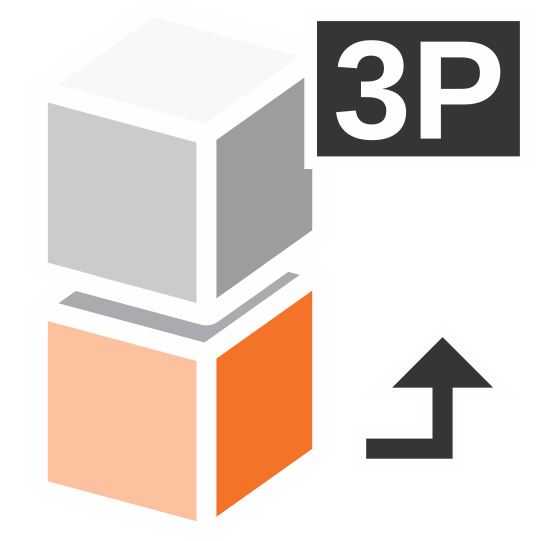
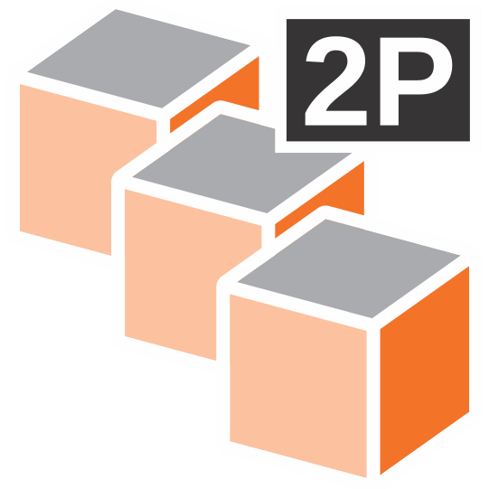
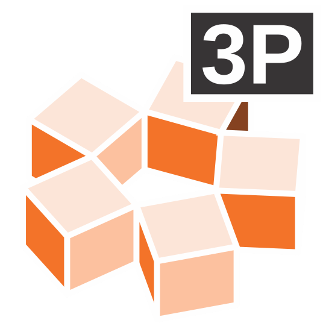

# IngeTrazo — IGZ Modify 3D

[](https://www.gnu.org/licenses/gpl-3.0)
[](https://www.python.org/)
[](https://doc.qt.io/qtforpython/)

A plugin for **[IngeTrazo](https://github.com/em-rezende)** that adds a **3D Modifiers**
toolbar with six point-driven 3D editing tools:

**Mirror · Scale · Rotate · Align · Array · Polar Array**

Each tool is fully interactive: it works on the current selection, previews the
result in real time while you move the cursor, snaps to geometry, and registers
its operation in the application's undo/redo history.

---

## Table of Contents

- [Features](#features)
- [Tools Overview](#tools-overview)
- [Requirements](#requirements)
- [Installation](#installation)
- [Usage](#usage)
  - [Mirror by 3 Points](#mirror-by-3-points)
  - [Scale by 3 Points](#scale-by-3-points)
  - [Rotate by 3 Points](#rotate-by-3-points)
  - [Align by Points](#align-by-points)
  - [Array by 2 Points](#array-by-2-points)
  - [Polar Array by Axis](#polar-array-by-axis)
- [Project Structure](#project-structure)
- [Localization](#localization)
- [Theming and Icons](#theming-and-icons)
- [Development Notes](#development-notes)
- [Contributing](#contributing)
- [License](#license)

---

## Features

- **A single, unified toolbar** — the "3D Modifiers" toolbar is created once and
  reused across sessions (it is looked up by its object name, `igz_tb_modify3d`).
- **Real-time previews** — every tool draws a wireframe bounding box, axis lines,
  or elastic "rubber band" guides while you pick points.
- **Snapping support** — the tools declare `uses_snap = True`, so they inherit the
  application's object snap behavior.
- **Undo/redo integration** — all modifications are committed through a history
  snapshot (`SnapshotImport`), so every operation can be undone and redone.
- **Works with groups and loose geometry** — grouped objects are transformed
  through their transform matrix (or their mesh when no matrix is present);
  standalone faces and edges are handled as well.
- **Theme-aware icons** — SVG icons come in a dark variant and a `_light` variant;
  the toolbar auto-detects the interface theme from the window palette.
- **Localized** — English and Brazilian Portuguese, resolved through the host
  application's i18n service with a local fallback dictionary.
- **Floatable and movable** — the toolbar can be docked anywhere or turned into a
  floating palette.

---

## Tools Overview

| Tool | Toolbar button | Icon | Description |
| --- | --- | --- | --- |
| **Mirror 3D** | Mirror by 3 Points |  | Reflects the selection across a plane defined by three points. Optionally deletes the originals. |
| **Scale 3D** | Scale by 3 Points |  | Uniformly scales the selection about a base point using a reference distance and a target distance. |
| **Rotate 3D** | Rotate by 3 Points |  | Rotates the selection around an axis derived from three points (center, reference, target). |
| **Align 3D** | Align by Points |  | AutoCAD-style alignment using three source points and their three matching target points. |
| **Array 3D** | Array by 2 Points |  | Creates copies of the selection along an offset vector (base point + step point). |
| **Polar Array 3D** | Polar Array by Axis |  | Creates copies of the selection rotated around an arbitrary 3D axis defined by two points. |

---

## Requirements

- **IngeTrazo** — the host application that provides the `core.*` and `tools.*`
  modules used by this plugin.
- **Python 3.x**
- **PySide6** (Qt for Python)

The plugin imports the following host modules:

```python
from tools.base import Tool, ToolContext
from core.group import Group, transformed_mesh
from core.mesh import Face, Edge
from core.history import SnapshotImport
from core.i18n import tr, current_language
```

If IngeTrazo or PySide6 is missing, the plugin will fail to load.

---

## Installation

1. Download or clone this repository.
2. Copy the plugin folder into IngeTrazo's **plugins** directory, alongside the
   other `igz_*` plugins:

   ```
   <IngeTrazo>/plugins/Ingetrazo-igz-modify-3d/
   ```

3. Make sure the folder contains its `__init__.py` (the package entry point that
   exposes `setup`).
4. Restart IngeTrazo.

On startup, IngeTrazo imports the package and calls its `setup(app)` function.
The plugin then creates the **3D Modifiers** toolbar in the top toolbar area.

> **Note:** The plugin is discovered through its package `__init__.py`:

```python
# plugins/__init__.py or the plugin package __init__.py
from .igz_tb_modify3d import setup

__all__ = ["setup"]
```

If the toolbar is not visible after restarting, make sure the plugin was placed in
the correct directory and that no import error was reported in the IngeTrazo log.

---

## Usage

All tools share the same workflow:

1. **Select** the objects you want to modify **before** activating a tool.
   If nothing is selected, the tool reports
   *"Select objects before starting …"* and exits.
2. Click the corresponding button on the **3D Modifiers** toolbar.
3. **Pick points** by clicking in the viewport. The status bar shows a prompt for
   each step, and a live preview follows your cursor.
4. The operation is applied when the last point is captured. Press **Esc** to
   cancel at any time.

The sections below describe the exact sequence for each tool.

### Mirror by 3 Points

Reflects the selection across a mirror plane defined by three points.

1. Pick **P1** — first point on the mirror plane.
2. Pick **P2** — second point on the plane.
3. Pick **P3** — third point on the plane.
4. A dialog asks: *"Do you want to delete the original objects?"* — choose
   **Yes** to keep only mirrored copies, or **No** to keep both.

The three points must not be collinear. A dashed bounding-box preview of the
reflected result is drawn as you pick the points.

### Scale by 3 Points

Uniformly scales the selection about a base point.

1. Pick **P1** — the base point (the fixed point of the scale).
2. Pick **P2** — the reference point (defines the original distance).
3. Pick **P3** — the target point (defines the new distance).

The scale factor is `|P3 − P1| / |P2 − P1|`, applied on all three axes.

### Rotate by 3 Points

Rotates the selection around an axis derived from three points.

1. Pick **P1** — the rotation center.
2. Pick **P2** — the reference point.
3. Pick **P3** — the target angle point.

The rotation axis is the cross product of the two vectors `P1→P2` and `P1→P3`,
and the angle is the angle between them. If the points are collinear, the tool
reports an error and restarts.

### Align by Points

An AutoCAD-style alignment that maps three source points to three matching target
points using orthonormal reference frames.

1. Pick **Source 1** — first point on the object to move.
2. Pick **Target 1** — the corresponding destination point.
3. Pick **Source 2** — second point on the object.
4. Pick **Target 2** — its destination.
5. Pick **Source 3** — third point on the object.
6. Pick **Target 3** — its destination.

The tool builds a local frame from each triplet
(`X` from source 1→2, `Z` = X × (1→3), `Y` = Z × X) and computes a single
transformation that maps the source frame onto the target frame. The result is
rejected if any triplet is degenerate or collinear.

### Array by 2 Points

Creates multiple copies of the selection along an offset vector.

1. Pick **P1** — the base point.
2. Pick **P2** — the step/offset point. The vector `P1→P2` is one array step.
3. Enter the **Number of copies** (1–100, default 3).

The preview shows the first three steps while you drag. Each copy is named
`"<original> (Array n)"`.

### Polar Array by Axis

Creates copies of the selection rotated around an arbitrary 3D axis.

1. Pick **P1** — the first point of the rotation axis.
2. Pick **P2** — the second point of the rotation axis.
3. Enter the **Number of copies** (2–360, default 6).
4. Enter the **Total angle (degrees)** (1–360, default 360).

The copies are distributed evenly over the total angle around the axis `P1→P2`.
Each copy is named `"<original> (Polar n)"`.

---

## Project Structure

```
Ingetrazo-igz-modify-3d/
├── __init__.py                # Package entry point — exposes setup()
├── igz_tb_modify3d.py         # Main loader — builds the "3D Modifiers" toolbar
├── modify3d/
│   ├── igz_align3d.py         # Align by Points tool
│   ├── igz_array3d.py         # Array by 2 Points tool
│   ├── igz_mirror3d.py        # Mirror by 3 Points tool
│   ├── igz_polararray3d.py    # Polar Array by Axis tool
│   ├── igz_rotate3d.py        # Rotate by 3 Points tool
│   ├── igz_scale3d.py         # Scale by 3 Points tool
│   └── icons/
│       ├── tb_align3d.svg          # dark-theme icon
│       ├── tb_align3d_light.svg    # light-theme icon
│       ├── tb_array3d.svg
│       ├── tb_array3d_light.svg
│       ├── tb_mirror3d.svg
│       ├── tb_mirror3d_light.svg
│       ├── tb_polararray3d.svg
│       ├── tb_polararray3d_light.svg
│       ├── tb_rotate3d.svg
│       ├── tb_rotate3d_light.svg
│       ├── tb_scale3d.svg
│       └── tb_scale3d_light.svg
├── Desenvolvimento/           # CorelDRAW (.cdr) icon sources — not versioned
├── LICENSE                    # GNU General Public License v3
├── README.md
└── .gitignore
```

The `modify3d` subfolder is added to `sys.path` at load time so that each tool
module can be imported as a top-level module (`import igz_mirror3d`).

---

## Localization

The plugin ships with English strings and Brazilian Portuguese translations.
Translations are resolved in two stages:

1. The host application's i18n service (`core.i18n.tr`) is tried first.
2. If it is unavailable or returns the original string, a local fallback
   dictionary (`_LOCAL`) is used.

```python
try:
    from core.i18n import tr, current_language
except Exception:
    def tr(s, **kw):
        return s.format(**kw) if kw else s
    def current_language():
        return "en"
```

To add a new language, add an entry to the `_LOCAL` dictionary in each tool module
(and in `igz_tb_modify3d.py` for the toolbar title and tool names), keyed by the
language code returned by `current_language()`.

---

## Theming and Icons

Icons are SVG files stored in `modify3d/icons/`. Each tool has two variants:

- `tb_<tool>.svg` — for **dark** interfaces (light-colored artwork).
- `tb_<tool>_light.svg` — for **light** interfaces (dark-colored artwork).

The toolbar detects the current theme from the window palette and picks the
matching icon automatically:

```python
palette = window.palette()
bg_color = palette.color(QPalette.Window)
is_dark = bg_color.lightness() < 128   # low lightness -> dark theme
```

If a `_light` icon is missing, the plugin falls back to the default icon. This
means you can override the icons of any tool simply by dropping a
`tb_<tool>_light.svg` file into the `icons` folder.

---

## Development Notes

- **Debug logging** — each module defines a `DEBUG` flag and a `_log()` helper that
  prints to `stderr`. Set `DEBUG = False` to silence the *"[igz_…]"* prefix output.
- **Icon sources** — the original CorelDRAW sources (`.cdr`) live in the
  `Desenvolvimento/` folder, which is excluded from version control via
  `.gitignore`. Only the exported `.svg` files are shipped.
- **Error handling** — transformations run inside a history snapshot; if the
  snapshot fails, the tool reports `… failed — see the IngeTrazo log` and the
  operation is rolled back.
- **Extending the toolbar** — to add a tool, create a new `igz_<tool>.py` module in
  `modify3d/`, import it in `igz_tb_modify3d.py`, and add a `QAction` that sets the
  tool as the active tool on the viewport.

---

## Contributing

Contributions, bug reports, and feature requests are welcome.

1. Fork the repository.
2. Create a feature branch: `git checkout -b feature/my-change`.
3. Commit your changes: `git commit -m "Add my change"`.
4. Push the branch: `git push origin feature/my-change`.
5. Open a Pull Request.

Please keep the existing code style, keep the GPL header on every source file, and
make sure the plugin still loads without errors in IngeTrazo.

---

## License

This project is licensed under the **GNU General Public License v3.0**
(or any later version). See the [LICENSE](LICENSE) file for the full text.

```
Copyright (C) 2026 IngeTrazo Contributors
Copyright (C) 2026 Ezequiel M Rezende

This program is free software: you can redistribute it and/or modify
it under the terms of the GNU General Public License as published by
the Free Software Foundation, either version 3 of the License, or
(at your option) any later version.

This program is distributed in the hope that it will be useful,
but WITHOUT ANY WARRANTY; without even the implied warranty of
MERCHANTABILITY or FITNESS FOR A PARTICULAR PURPOSE.  See the
GNU General Public License for more details.

You should have received a copy of the GNU General Public License
along with this program.  If not, see <https://www.gnu.org/licenses/>.
```

---

## Acknowledgements

- Built on **Qt for Python (PySide6)**.
- Part of the **IngeTrazo** ecosystem.

